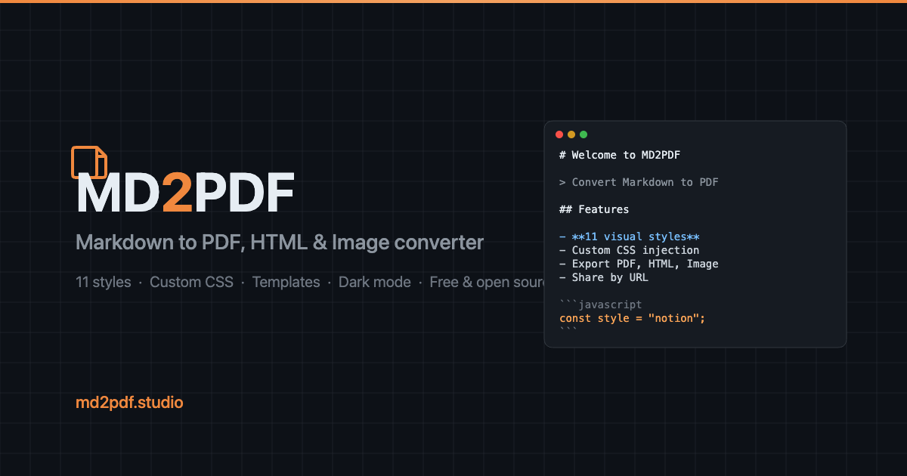

# MD2PDF

**[md2pdf.studio](https://md2pdf.studio)** — Convert Markdown to beautifully styled PDFs, HTML, and images. Runs entirely in your browser. Free, no signup.

[](LICENSE)
[](https://workers.cloudflare.com/)
[](https://md2pdf.studio/ai-skill)
[](https://md2pdf.studio/ai-skill)
[](https://md2pdf.studio/llms-full.txt)
[](https://md2pdf.studio/api)



---

## Features

- **Live Preview** — Split editor with real-time rendering
- **11 Visual Styles** — Notion, GitHub, Minimal, Academic, Corporate, LaTeX, Dracula, Newspaper, Handwritten, Terminal, Pastel
- **5 Templates** — CV/Resume, Report, Documentation, Changelog, Meeting Notes
- **Export** — PDF (continuous, no page breaks), HTML (standalone with inline styles), PNG
- **Custom CSS** — Inject your own styles
- **Share by URL** — AES-256-GCM encrypted short links
- **Mermaid diagrams** — Flowcharts, sequence, Gantt, pie
- **Auto table of contents**, **syntax highlighting** (180+ languages)
- **Dark & Light Mode**, **Drag & Drop**, **Find & Replace**, **Scroll Sync**, **Fullscreen**, **Word Count**, **Auto-Save**
- **AI Skill** — Installable [Claude Skill](https://md2pdf.studio/ai-skill) + public [REST API](https://md2pdf.studio/api) + WebMCP
- **AI Discoverable** — `llms.txt`, `robots.txt`, JSON-LD, Open Graph, `ai-plugin.json`

## Tech Stack

- Pure **HTML**, **CSS**, **JavaScript** — no framework, no build step
- **Cloudflare Workers** — edge compute for shared-document rendering and the REST API
- **Cloudflare KV** — AES-256-GCM encrypted document storage
- [marked.js](https://github.com/markedjs/marked) — Markdown parsing
- [highlight.js](https://github.com/highlightjs/highlight.js) — Syntax highlighting
- [mermaid](https://github.com/mermaid-js/mermaid) — Diagrams
- [html2canvas](https://github.com/niklasvh/html2canvas) — Image export
- [LZ-String](https://github.com/pieroxy/lz-string) — URL sharing compression

## Quick Start

No install required. Visit [md2pdf.studio](https://md2pdf.studio).

Or run locally:

```bash
git clone https://github.com/JSiapoDEV/MD2PDF.git
cd MD2PDF
open public/index.html
```

For local Cloudflare Workers dev:

```bash
npx wrangler dev
```

## For AI Agents

- Install the Claude Skill: [md2pdf.studio/skill.md](https://md2pdf.studio/skill.md)
- REST API docs: [md2pdf.studio/api](https://md2pdf.studio/api)
- LLM documentation: [md2pdf.studio/llms-full.txt](https://md2pdf.studio/llms-full.txt)
- WebMCP: supported inline on the main app

## Keyboard Shortcuts

| Shortcut | Action |
|----------|--------|
| `Ctrl + S` | Export to PDF |
| `Ctrl + F` | Find |
| `Ctrl + H` | Find & Replace |
| `Ctrl + Shift + L` | Toggle dark/light theme |
| `F11` | Toggle fullscreen |
| `Tab` | Insert tab in editor |

## Available Styles

| Style | Description |
|-------|-------------|
| **Notion** | Clean, modern sans-serif (default) |
| **GitHub** | Classic GitHub markdown rendering |
| **Minimal** | Elegant serif, no decorations |
| **Academic** | Formal justified text, scholarly feel |
| **Corporate** | Professional with blue accents |
| **LaTeX** | Simulates academic papers |
| **Dracula** | Vibrant purple/pink/green palette |
| **Newspaper** | Editorial typography |
| **Handwritten** | Cursive font with notebook lines |
| **Terminal** | Green-on-black monospace |
| **Pastel** | Soft colors with rounded elements |

Browse all: [md2pdf.studio/styles](https://md2pdf.studio/styles/)

## Contributing

Contributions are welcome. Please read [CONTRIBUTING.md](CONTRIBUTING.md) before getting started.

## License

[MIT](LICENSE) — Built by [JSiapoDev](https://jsiapo.dev)

---

<sub>**Recommended GitHub Topics** (add via repo settings → About → Topics): `markdown` · `pdf` · `markdown-to-pdf` · `claude-skill` · `llms-txt` · `ai-agent` · `mcp` · `webmcp` · `cloudflare-workers` · `mermaid` · `markdown-editor` · `pdf-generator`</sub>
